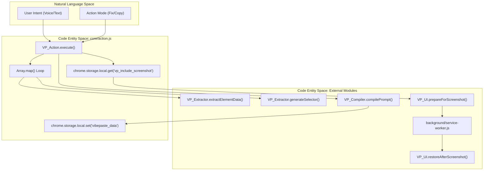
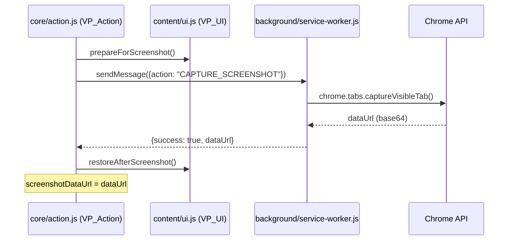

# Action Orchestration (VP_Action)

> **Relevant source files**
> * [background/service-worker.js](https://github.com/mohsinproduct/vibepaste/blob/f3147148/background/service-worker.js)
> * [core/action.js](https://github.com/mohsinproduct/vibepaste/blob/f3147148/core/action.js)

The `VP_Action` module serves as the central controller for the VibePaste processing pipeline. It orchestrates the flow of data from the DOM to the extension's local storage, coordinating between the extraction engine, the screenshot utility, and the prompt compiler.

## The execute() Pipeline

The primary entry point for the orchestration logic is the `VP_Action.execute` function [core/action.js L4-L69](https://github.com/mohsinproduct/vibepaste/blob/f3147148/core/action.js#L4-L69)

 This asynchronous pipeline manages the transition of user-selected elements into a structured "Vibe" (a combination of a text prompt and an optional visual screenshot).

### Data Flow Overview

The execution pipeline follows a strict sequence of operations:

1. **Validation**: Ensures that at least one element is selected before proceeding [core/action.js L5-L7](https://github.com/mohsinproduct/vibepaste/blob/f3147148/core/action.js#L5-L7)
2. **Extraction**: Iterates through `selectedElements` and utilizes `VP_Extractor` to retrieve HTML and computed styles [core/action.js L11-L21](https://github.com/mohsinproduct/vibepaste/blob/f3147148/core/action.js#L11-L21)
3. **Screenshot Lifecycle**: If enabled in settings, it triggers a UI-clean capture via the background service worker [core/action.js L24-L45](https://github.com/mohsinproduct/vibepaste/blob/f3147148/core/action.js#L24-L45)
4. **Compilation**: Passes the extracted data, user intent, and mode to `VP_Compiler` to generate the final LLM prompt [core/action.js L48-L52](https://github.com/mohsinproduct/vibepaste/blob/f3147148/core/action.js#L48-L52)
5. **Persistence**: Saves the resulting prompt and image data to `chrome.storage.local` under the key `vibepaste_data` [core/action.js L55-L60](https://github.com/mohsinproduct/vibepaste/blob/f3147148/core/action.js#L55-L60)

### Action Orchestration Logic

The following diagram illustrates how `VP_Action.execute` coordinates different system entities.

**Diagram: execute() Orchestration Flow**

**Sources:** [core/action.js L3-L69](https://github.com/mohsinproduct/vibepaste/blob/f3147148/core/action.js#L3-L69)

 [background/service-worker.js L45-L58](https://github.com/mohsinproduct/vibepaste/blob/f3147148/background/service-worker.js#L45-L58)

## Screenshot Lifecycle

The screenshot process is a cross-context operation because content scripts lack the permission to capture tab pixels directly. `VP_Action` acts as the requester in this handshake.

1. **Preparation**: `VP_Action` calls `VP_UI.prepareForScreenshot()` [core/action.js L31](https://github.com/mohsinproduct/vibepaste/blob/f3147148/core/action.js#L31-L31)  This typically adds a CSS class (like `vibepaste-capturing`) to the body to hide the VibePaste overlays and badges so they do not appear in the final image.
2. **Messaging**: It sends a `CAPTURE_SCREENSHOT` message to the background service worker using `chrome.runtime.sendMessage` [core/action.js L33](https://github.com/mohsinproduct/vibepaste/blob/f3147148/core/action.js#L33-L33)
3. **Capture**: The service worker invokes `chrome.tabs.captureVisibleTab` [background/service-worker.js L46](https://github.com/mohsinproduct/vibepaste/blob/f3147148/background/service-worker.js#L46-L46)  which returns a base64 encoded PNG `dataUrl`.
4. **Restoration**: Once the worker responds, `VP_Action` calls `VP_UI.restoreAfterScreenshot()` [core/action.js L35](https://github.com/mohsinproduct/vibepaste/blob/f3147148/core/action.js#L35-L35)  to bring back the UI elements.
5. **Fallback**: If the screenshot fails or is disabled in settings (`vp_include_screenshot`), the pipeline continues with `screenshotDataUrl` set to `null` [core/action.js L41-L44](https://github.com/mohsinproduct/vibepaste/blob/f3147148/core/action.js#L41-L44)

**Diagram: Cross-Context Screenshot Pipeline**

**Sources:** [core/action.js L30-L45](https://github.com/mohsinproduct/vibepaste/blob/f3147148/core/action.js#L30-L45)

 [background/service-worker.js L45-L58](https://github.com/mohsinproduct/vibepaste/blob/f3147148/background/service-worker.js#L45-L58)

## Error Handling and State Recovery

The `execute` pipeline is wrapped in a `try...catch` block to ensure the browser remains responsive even if extraction or communication fails.

* **UI Cleanup**: If an error occurs during the screenshot or compilation phase, the code explicitly removes the `vibepaste-capturing` class from `document.body` [core/action.js L65](https://github.com/mohsinproduct/vibepaste/blob/f3147148/core/action.js#L65-L65)  This prevents the UI from being permanently hidden if the `restoreAfterScreenshot` call is bypassed by an exception.
* **Response Structure**: The function always returns a consistent object: * **Success**: `{ success: true, count: number }` [core/action.js L62](https://github.com/mohsinproduct/vibepaste/blob/f3147148/core/action.js#L62-L62) * **Failure**: `{ success: false, error: string }` [core/action.js L67](https://github.com/mohsinproduct/vibepaste/blob/f3147148/core/action.js#L67-L67)

## Data Persistence (vibepaste_data)

The final step of the orchestration is persisting the payload. This allows the extension to "hand off" the data to the clipboard or a subsequent UI update.

| Key | Type | Description |
| --- | --- | --- |
| `text` | `string` | The full Markdown-formatted prompt generated by `VP_Compiler`. |
| `image` | `string` | The base64 `dataUrl` of the captured screenshot (or `null`). |

**Sources:** [core/action.js L55-L60](https://github.com/mohsinproduct/vibepaste/blob/f3147148/core/action.js#L55-L60)