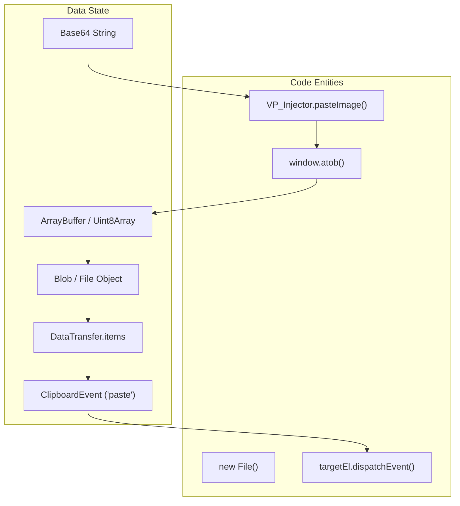

# Content Injector (VP_Injector)

> **Relevant source files**
> * [content/injector.js](https://github.com/mohsinproduct/vibepaste/blob/f3147148/content/injector.js)
> * [content/styles.css](https://github.com/mohsinproduct/vibepaste/blob/f3147148/content/styles.css)

The `VP_Injector` module is the final stage of the VibePaste pipeline. It is responsible for receiving the processed content (text or images) stored in the browser's local storage and programmatically injecting it into the user's currently focused input element. It handles the nuances of different input types, including standard text areas, input fields, and `contenteditable` elements.

## Module Initialization and Message Handling

The `VP_Injector` object is initialized immediately upon the script loading in the content script context. It sets up a listener for the `EXECUTE_PASTE` message, which is typically dispatched by the background service worker in response to the user pressing the "Paste" keyboard shortcut (`Alt+V`).

### Injection Entry Point

When the `EXECUTE_PASTE` message is received, the module triggers the `executePaste` workflow.

1. **Focus Validation**: The module first identifies the `document.activeElement`. Injection only proceeds if the active element is a valid input target (e.g., `TEXTAREA`, `INPUT`, or an element with `isContentEditable` set to true) [content/injector.js L12-L18](https://github.com/mohsinproduct/vibepaste/blob/f3147148/content/injector.js#L12-L18)
2. **Data Retrieval**: It fetches the `vibepaste_data` object from `chrome.storage.local`. This object contains the text and/or image data generated by the `VP_Compiler` [content/injector.js L20-L25](https://github.com/mohsinproduct/vibepaste/blob/f3147148/content/injector.js#L20-L25)
3. **Dispatch**: Based on the contents of the retrieved data, it calls `pasteText` and/or `pasteImage` [content/injector.js L27-L28](https://github.com/mohsinproduct/vibepaste/blob/f3147148/content/injector.js#L27-L28)

**Sources:**

* [content/injector.js L3-L10](https://github.com/mohsinproduct/vibepaste/blob/f3147148/content/injector.js#L3-L10)  (Initialization)
* [content/injector.js L12-L30](https://github.com/mohsinproduct/vibepaste/blob/f3147148/content/injector.js#L12-L30)  (executePaste logic)

## Text Injection Strategy

The `pasteText` function employs a dual-layered approach to ensure compatibility across various web applications.

| Method | Implementation | Description |
| --- | --- | --- |
| **Primary** | `document.execCommand('insertText', ...)` | The preferred method as it integrates with the browser's undo/redo stack and handles selection replacement automatically [content/injector.js L33](https://github.com/mohsinproduct/vibepaste/blob/f3147148/content/injector.js#L33-L33) |
| **Fallback** | `DataTransfer` + `ClipboardEvent` | If `execCommand` fails (returns `false`), the module manually constructs a `ClipboardEvent` with a `DataTransfer` object containing the plain text and dispatches it to the target element [content/injector.js L34-L41](https://github.com/mohsinproduct/vibepaste/blob/f3147148/content/injector.js#L34-L41) |

**Sources:**

* [content/injector.js L32-L43](https://github.com/mohsinproduct/vibepaste/blob/f3147148/content/injector.js#L32-L43)  (pasteText function)

## Image Injection Pipeline

The `pasteImage` function handles the conversion of base64-encoded strings (often screenshots or context images) back into binary formats that web applications can process via paste events.

### Data Transformation Flow

To simulate a real user pasting an image, the injector performs the following transformations:

1. **Base64 to Binary**: Splits the data URL to extract the mime type and the base64 string, then converts it to a `byteString` using `atob` [content/injector.js L48-L49](https://github.com/mohsinproduct/vibepaste/blob/f3147148/content/injector.js#L48-L49)
2. **Buffer Allocation**: Creates an `ArrayBuffer` and a `Uint8Array` to hold the binary data [content/injector.js L51-L56](https://github.com/mohsinproduct/vibepaste/blob/f3147148/content/injector.js#L51-L56)
3. **Blob/File Creation**: Encapsulates the buffer into a `Blob`, which is then wrapped in a `File` object named `vibepaste_context.png` [content/injector.js L58-L59](https://github.com/mohsinproduct/vibepaste/blob/f3147148/content/injector.js#L58-L59)
4. **Event Dispatch**: Adds the `File` to a `DataTransfer` container and dispatches a synthetic `paste` event to the target element [content/injector.js L61-L68](https://github.com/mohsinproduct/vibepaste/blob/f3147148/content/injector.js#L61-L68)

**Sources:**

* [content/injector.js L45-L74](https://github.com/mohsinproduct/vibepaste/blob/f3147148/content/injector.js#L45-L74)  (pasteImage function)

## System Architecture Diagrams

### Logic Flow: EXECUTE_PASTE Handler

This diagram illustrates the decision logic when a paste command is received from the background script.

```

```

**Sources:**

* [content/injector.js L4-L30](https://github.com/mohsinproduct/vibepaste/blob/f3147148/content/injector.js#L4-L30)

### Data Flow: Image Injection Pipeline

This diagram maps the transformation of data from a storage string to a DOM event.



**Sources:**

* [content/injector.js L45-L69](https://github.com/mohsinproduct/vibepaste/blob/f3147148/content/injector.js#L45-L69)

## Target Validation Table

The injector strictly validates the target element to prevent console errors or "ghost" pastes into non-input areas.

| Property | Requirement | File Reference |
| --- | --- | --- |
| `activeEl` | Must not be null | [content/injector.js L15](https://github.com/mohsinproduct/vibepaste/blob/f3147148/content/injector.js#L15-L15) |
| `isContentEditable` | `true` OR... | [content/injector.js L15](https://github.com/mohsinproduct/vibepaste/blob/f3147148/content/injector.js#L15-L15) |
| `tagName` | Must be `TEXTAREA` or `INPUT` | [content/injector.js L15](https://github.com/mohsinproduct/vibepaste/blob/f3147148/content/injector.js#L15-L15) |

**Sources:**

* [content/injector.js L13-L18](https://github.com/mohsinproduct/vibepaste/blob/f3147148/content/injector.js#L13-L18)