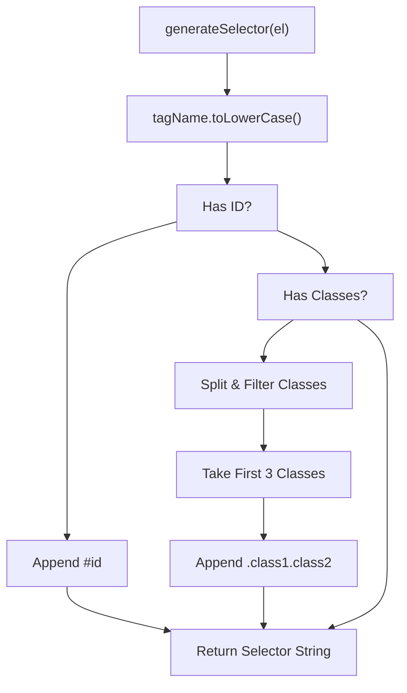

# DOM Extraction (VP_Extractor)

> **Relevant source files**
> * [core/extractor.js](https://github.com/mohsinproduct/vibepaste/blob/f3147148/core/extractor.js)

The `VP_Extractor` module is the primary engine for converting live DOM elements into a structured data format suitable for LLM processing. It captures the structural HTML, computes a subset of essential CSS styles, and sanitizes the resulting payload to prevent token bloat and context window overflow.

### Core Extraction Pipeline

The extraction process begins when `VP_Action` calls the `VP_Extractor` to process a selected element. The module breaks down the element into three distinct components: its tag name, a sanitized version of its HTML, and a filtered set of computed styles.

#### Data Flow: Element to Structured Object

The diagram below illustrates how `extractElementData` orchestrates the transformation of a raw DOM element into a data object.

**VP_Extractor Data Flow**

```

```

**Sources:** [core/extractor.js L55-L61](https://github.com/mohsinproduct/vibepaste/blob/f3147148/core/extractor.js#L55-L61)

 [core/extractor.js L40-L53](https://github.com/mohsinproduct/vibepaste/blob/f3147148/core/extractor.js#L40-L53)

 [core/extractor.js L26-L38](https://github.com/mohsinproduct/vibepaste/blob/f3147148/core/extractor.js#L26-L38)

---

### Style Computation and Filtering

To provide the LLM with visual context without overwhelming the prompt with thousands of CSS properties, `VP_Extractor` uses a whitelist approach. It utilizes `window.getComputedStyle` to retrieve the actual rendered values of an element.

#### KEY_STYLES Whitelist

The module defines a constant `KEY_STYLES` containing 16 properties considered critical for layout and appearance:

* **Layout:** `display`, `flex-direction`, `justify-content`, `align-items`, `gap`, `padding`, `margin`, `width`, `height`.
* **Visuals:** `color`, `background-color`, `border`, `border-radius`.
* **Typography:** `font-size`, `font-weight`, `text-align`.

**Sources:** [core/extractor.js L4-L9](https://github.com/mohsinproduct/vibepaste/blob/f3147148/core/extractor.js#L4-L9)

#### Style Sanitization Logic

The `extractStyles` function filters out default or "empty" values to further reduce payload size. Values are excluded if they are:

1. `none`
2. `normal`
3. `0px`
4. `rgba(0, 0, 0, 0)` (Transparent)

**Sources:** [core/extractor.js L26-L38](https://github.com/mohsinproduct/vibepaste/blob/f3147148/core/extractor.js#L26-L38)

---

### HTML Sanitization and Truncation

The `extractHTML` function is responsible for capturing the element's markup while stripping out high-entropy data that is irrelevant to structural understanding.

| Sanitization Step | Implementation Detail | Purpose |
| --- | --- | --- |
| **Node Cloning** | `element.cloneNode(true)` | Prevents accidental modification of the live DOM during processing. |
| **SVG Truncation** | `svg.innerHTML = ''` | Removes complex path data while keeping the `<svg>` tag as a structural placeholder. |
| **Image Truncation** | `img.src = 'data:image/...truncated...'` | Replaces long Base64 strings (exceeding 100 chars) to prevent massive prompt bloat. |
| **Output Generation** | `clone.outerHTML` | Returns the final sanitized string representation. |

**Sources:** [core/extractor.js L40-L53](https://github.com/mohsinproduct/vibepaste/blob/f3147148/core/extractor.js#L40-L53)

---

### Selector Generation

The `generateSelector` function creates a human-readable CSS selector for the element, which is used by the `VP_Compiler` to identify the element within the prompt.

**Selector Logic Flow**



**Sources:** [core/extractor.js L11-L24](https://github.com/mohsinproduct/vibepaste/blob/f3147148/core/extractor.js#L11-L24)

### Implementation Reference

| Function | Responsibility |
| --- | --- |
| `extractElementData(element)` | Entry point for extracting a complete element profile. |
| `extractHTML(element)` | Clones and sanitizes the DOM tree. |
| `extractStyles(element)` | Computes and filters CSS properties against the `KEY_STYLES` list. |
| `generateSelector(el)` | Generates a CSS selector string using ID or the first three classes. |

**Sources:** [core/extractor.js L3-L62](https://github.com/mohsinproduct/vibepaste/blob/f3147148/core/extractor.js#L3-L62)