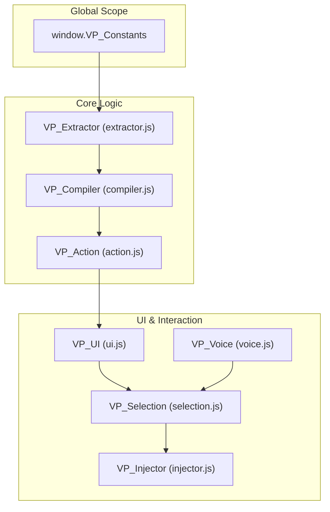
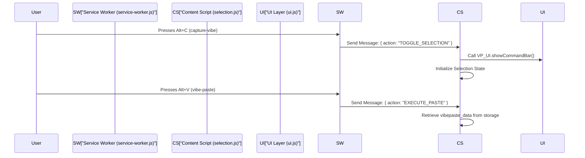

# Extension Architecture & Manifest

> **Relevant source files**
> * [manifest.json](https://github.com/mohsinproduct/vibepaste/blob/f3147148/manifest.json)
> * [shared/constants.js](https://github.com/mohsinproduct/vibepaste/blob/f3147148/shared/constants.js)

This page provides a detailed technical breakdown of the VibePaste Chrome Extension architecture as defined by its Manifest V3 configuration. It explores how the extension coordinates between background processes, content scripts, and user-triggered commands to enable seamless UI element capture and AI prompt generation.

## Manifest Configuration Overview

VibePaste utilizes **Manifest V3 (MV3)**, adhering to modern browser security and performance standards. The configuration centralizes the registration of permissions, keyboard shortcuts, and the multi-layered content script injection strategy.

### Core Permissions

The extension requests a minimal but powerful set of permissions to facilitate cross-tab interaction and data persistence:

* `activeTab`: Grants temporary access to the current tab when the user invokes the extension, allowing for screenshot capture and DOM manipulation `<FileRef file-url="https://github.com/mohsinproduct/vibepaste/blob/f3147148/manifest.json#L7-L7" min=7  file-path="manifest.json">Hii</FileRef>`.
* `storage` & `unlimitedStorage`: Used to persist user settings and large captured payloads (including base64 images and HTML snippets) `<FileRef file-url="https://github.com/mohsinproduct/vibepaste/blob/f3147148/manifest.json#L8-L10" min=8 max=10 file-path="manifest.json">Hii</FileRef>`.
* `scripting`: Enables the background service worker to execute logic within the context of web pages `<FileRef file-url="https://github.com/mohsinproduct/vibepaste/blob/f3147148/manifest.json#L9-L9" min=9  file-path="manifest.json">Hii</FileRef>`.

### Messaging & Resource Access

To render custom UI elements (like the command bar and element badges) within the host page, VibePaste declares its asset library as web-accessible. This allows the `VP_UI` module to load SVG icons and PNGs via `chrome.runtime.getURL` `<FileRef file-url="https://github.com/mohsinproduct/vibepaste/blob/f3147148/manifest.json#L21-L26" min=21 max=26 file-path="manifest.json">Hii</FileRef>`.

## Content Script Injection Architecture

VibePaste employs a strict injection order to manage dependencies between its core processing modules and interactive UI layers. All scripts are injected into `<all_urls>` to ensure availability across any development environment `<FileRef file-url="https://github.com/mohsinproduct/vibepaste/blob/f3147148/manifest.json#L54-L54" min=54  file-path="manifest.json">Hii</FileRef>`.

### Injection Order & Dependencies

The scripts are loaded in the following sequence to establish the global namespace and shared utilities before the interaction logic initializes:

| Order | File | Responsibility |
| --- | --- | --- |
| 1 | `shared/constants.js` | Defines global `window.VP_Constants` (e.g., `MODES.FIX`, `MODES.COPY`) `<FileRef file-url="https://github.com/mohsinproduct/vibepaste/blob/f3147148/shared/constants.js#L2-L6" min=2 max=6 file-path="shared/constants.js">Hii</FileRef>`. |
| 2 | `core/extractor.js` | `VP_Extractor`: Logic for DOM serialization and CSS computation. |
| 3 | `core/compiler.js` | `VP_Compiler`: Assembles the LLM prompt from extracted data. |
| 4 | `core/action.js` | `VP_Action`: Orchestrates the high-level execution pipeline. |
| 5 | `content/ui.js` | `VP_UI`: Manages the command bar, overlays, and SVG rendering. |
| 6 | `content/voice.js` | `VP_Voice`: Handles Web Speech API for intent dictation. |
| 7 | `content/selection.js` | `VP_Selection`: The main state machine for mouse events and element picking. |
| 8 | `content/injector.js` | `VP_Injector`: Handles final prompt/image delivery into the target editor. |

**Sources:** `<FileRef file-url="https://github.com/mohsinproduct/vibepaste/blob/f3147148/manifest.json#L56-L65" min=56 max=65 file-path="manifest.json">Hii</FileRef>`, `<FileRef file-url="https://github.com/mohsinproduct/vibepaste/blob/f3147148/shared/constants.js#L1-L7" min=1 max=7 file-path="shared/constants.js">Hii</FileRef>`

### Script Dependency Graph

The following diagram illustrates how the `manifest.json` load order bridges the "Natural Language Space" (User Features) to the "Code Entity Space" (Modules).

**VibePaste Module Dependency Flow**

**Sources:** `<FileRef file-url="https://github.com/mohsinproduct/vibepaste/blob/f3147148/manifest.json#L56-L65" min=56 max=65 file-path="manifest.json">Hii</FileRef>`, `<FileRef file-url="https://github.com/mohsinproduct/vibepaste/blob/f3147148/shared/constants.js#L2-L6" min=2 max=6 file-path="shared/constants.js">Hii</FileRef>`

## Background Service Worker & Commands

The background service worker (`background/service-worker.js`) acts as the extension's central nervous system, routing hardware-level keyboard events to the appropriate content script logic `<FileRef file-url="https://github.com/mohsinproduct/vibepaste/blob/f3147148/manifest.json#L33-L35" min=33 max=35 file-path="manifest.json">Hii</FileRef>`.

### Keyboard Commands

VibePaste registers three primary global shortcuts that allow users to control the extension without interacting with the popup UI:

| Command | Default Key | Description | Internal Message Action |
| --- | --- | --- | --- |
| `capture-vibe` | `Alt+C` | Toggles the element selection mode. | `TOGGLE_SELECTION` |
| `vibe-paste` | `Alt+V` | Triggers the injection of the compiled prompt. | `EXECUTE_PASTE` |
| `pause-vibe` | `Alt+P` | Pauses/Unpauses the selection engine. | `TOGGLE_PAUSE` |

**Sources:** `<FileRef file-url="https://github.com/mohsinproduct/vibepaste/blob/f3147148/manifest.json#L37-L50" min=37 max=50 file-path="manifest.json">Hii</FileRef>`

### Communication Flow

The architecture follows a hub-and-spoke model where the Service Worker intercepts browser-level events and dispatches them to the `activeTab`.

**Command Routing Data Flow**

**Sources:** `<FileRef file-url="https://github.com/mohsinproduct/vibepaste/blob/f3147148/manifest.json#L37-L50" min=37 max=50 file-path="manifest.json">Hii</FileRef>`, `<FileRef file-url="https://github.com/mohsinproduct/vibepaste/blob/f3147148/manifest.json#L33-L35" min=33 max=35 file-path="manifest.json">Hii</FileRef>`

## Web Accessible Resources

VibePaste requires access to local assets to build its custom UI overlays inside the DOM of the pages the user is visiting. These are explicitly whitelisted in the manifest `<FileRef file-url="https://github.com/mohsinproduct/vibepaste/blob/f3147148/manifest.json#L21-L26" min=21 max=26 file-path="manifest.json">Hii</FileRef>`.

* **Icons**: PNG icons for the browser toolbar (16px to 128px) `<FileRef file-url="https://github.com/mohsinproduct/vibepaste/blob/f3147148/manifest.json#L13-L19" min=13 max=19 file-path="manifest.json">Hii</FileRef>`.
* **UI Assets**: SVG icons used within the `VP_UI` command bar (e.g., `mic_on.svg`, `wrench.svg`) are made accessible to `<all_urls>` to prevent Content Security Policy (CSP) violations when injecting images into third-party sites `<FileRef file-url="https://github.com/mohsinproduct/vibepaste/blob/f3147148/manifest.json#L23-L24" min=23 max=24 file-path="manifest.json">Hii</FileRef>`.

**Sources:** `<FileRef file-url="https://github.com/mohsinproduct/vibepaste/blob/f3147148/manifest.json#L13-L26" min=13 max=26 file-path="manifest.json">Hii</FileRef>`