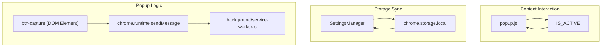

# Popup Logic & Settings Manager

> **Relevant source files**
> * [popup/popup.js](https://github.com/mohsinproduct/vibepaste/blob/f3147148/popup/popup.js)

The popup logic serves as the primary configuration interface for VibePaste, managing user preferences and providing a manual trigger for the selection engine. It is governed by the `SettingsManager` object, which synchronizes the UI state with `chrome.storage.local`.

## SettingsManager Lifecycle

The `SettingsManager` handles the persistence and application of extension settings. It uses a configuration schema to map DOM elements to storage keys.

### Configuration Schema

The manager defines four primary settings in its `config` array [popup/popup.js L9-L14](https://github.com/mohsinproduct/vibepaste/blob/f3147148/popup/popup.js#L9-L14)

:

| Key | Type | Default | Description |
| --- | --- | --- | --- |
| `vibepaste_mode` | radio | `'fix'` | Determines if the extension is in "Fix" or "Copy" mode. |
| `vp_include_screenshot` | checkbox | `true` | Toggles whether a visual screenshot is sent to the LLM. |
| `vp_auto_mic` | checkbox | `false` | If true, voice input starts automatically upon selection. |
| `vp_enable_guidance` | checkbox | `true` | Toggles the inclusion of intent-based guidance in the prompt. |

### Lifecycle Methods

1. **init()**: Triggered on `DOMContentLoaded`. It retrieves current values from `chrome.storage.local`, populates the UI, and attaches event listeners [popup/popup.js L16-L33](https://github.com/mohsinproduct/vibepaste/blob/f3147148/popup/popup.js#L16-L33)
2. **updateUI()**: Synchronizes the visual state of checkboxes and radio buttons based on stored or default values [popup/popup.js L35-L42](https://github.com/mohsinproduct/vibepaste/blob/f3147148/popup/popup.js#L35-L42)
3. **attachListener()**: Binds `change` events to UI inputs to trigger the `save()` method [popup/popup.js L44-L56](https://github.com/mohsinproduct/vibepaste/blob/f3147148/popup/popup.js#L44-L56)
4. **save()**: Persists a single key-value pair to `chrome.storage.local` [popup/popup.js L58-L60](https://github.com/mohsinproduct/vibepaste/blob/f3147148/popup/popup.js#L58-L60)
5. **reset()**: Clears the `vibepaste_data` buffer and restores all settings to their default values [popup/popup.js L62-L69](https://github.com/mohsinproduct/vibepaste/blob/f3147148/popup/popup.js#L62-L69)

### Flicker Prevention

To prevent CSS transitions from firing while the `SettingsManager` is populating the UI, the script utilizes a `preload-transitions` pattern. The `body` element starts with this class (defined in CSS to disable transitions) and is removed via `setTimeout` only after `init()` completes [popup/popup.js L31](https://github.com/mohsinproduct/vibepaste/blob/f3147148/popup/popup.js#L31-L31)

**Sources:** [popup/popup.js L8-L73](https://github.com/mohsinproduct/vibepaste/blob/f3147148/popup/popup.js#L8-L73)

---

## Messaging & Handshaking

The popup interacts with both the active tab's content scripts and the background service worker to coordinate state and actions.

### IS_ACTIVE Handshake

When the popup opens, it performs a handshake with the content script to determine if the selection engine is already running [popup/popup.js L78-L89](https://github.com/mohsinproduct/vibepaste/blob/f3147148/popup/popup.js#L78-L89)

```

```

**Sources:** [popup/popup.js L78-L89](https://github.com/mohsinproduct/vibepaste/blob/f3147148/popup/popup.js#L78-L89)

### Action Triggering

The "Capture" button (`btn-capture`) serves a dual purpose based on the extension state. Clicking it sends a `TRIGGER_FROM_POPUP` message to the background service worker and closes the popup [popup/popup.js L92-L95](https://github.com/mohsinproduct/vibepaste/blob/f3147148/popup/popup.js#L92-L95)



**Sources:** [popup/popup.js L78-L95](https://github.com/mohsinproduct/vibepaste/blob/f3147148/popup/popup.js#L78-L95)

---

## Reset Logic & State Clearing

The `btnReset` logic handles the restoration of the extension to a "clean" state. This involves two distinct operations:

1. **Data Clearing**: It removes `vibepaste_data` from local storage [popup/popup.js L63](https://github.com/mohsinproduct/vibepaste/blob/f3147148/popup/popup.js#L63-L63)  This is critical because `vibepaste_data` holds the current extraction buffer (HTML, styles, and screenshot) managed by `VP_Action`.
2. **Settings Restoration**: It iterates through the `SettingsManager.config` array, resetting each key to its `default` value in both storage and the UI [popup/popup.js L65-L68](https://github.com/mohsinproduct/vibepaste/blob/f3147148/popup/popup.js#L65-L68)

The UI provides feedback via the `vp-animate-reset` CSS class and a temporary text change to "Cleared!" [popup/popup.js L101-L107](https://github.com/mohsinproduct/vibepaste/blob/f3147148/popup/popup.js#L101-L107)

**Sources:** [popup/popup.js L62-L69](https://github.com/mohsinproduct/vibepaste/blob/f3147148/popup/popup.js#L62-L69)

 [popup/popup.js L98-L108](https://github.com/mohsinproduct/vibepaste/blob/f3147148/popup/popup.js#L98-L108)

---

## External Links

The popup provides a direct link to the Chrome Shortcuts management page via `btnShortcuts`. This allows users to configure the `Alt+C` (Capture), `Alt+V` (Paste), and `Alt+P` (Pause) shortcuts easily [popup/popup.js L111-L113](https://github.com/mohsinproduct/vibepaste/blob/f3147148/popup/popup.js#L111-L113)

**Sources:** [popup/popup.js L111-L113](https://github.com/mohsinproduct/vibepaste/blob/f3147148/popup/popup.js#L111-L113)