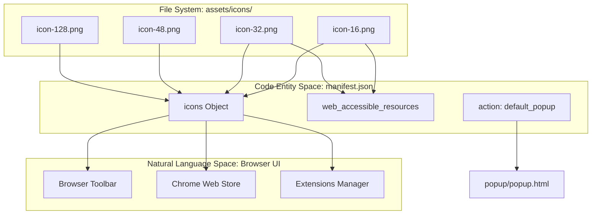
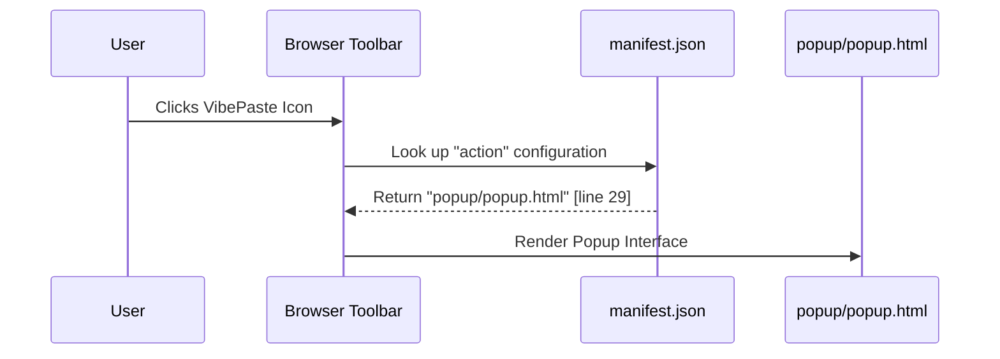

# Extension Toolbar Icons

> **Relevant source files**
> * [assets/icons/icon-128.png](https://github.com/mohsinproduct/vibepaste/blob/f3147148/assets/icons/icon-128.png)
> * [assets/icons/icon-16.png](https://github.com/mohsinproduct/vibepaste/blob/f3147148/assets/icons/icon-16.png)
> * [assets/icons/icon-32.png](https://github.com/mohsinproduct/vibepaste/blob/f3147148/assets/icons/icon-32.png)
> * [assets/icons/icon-48.png](https://github.com/mohsinproduct/vibepaste/blob/f3147148/assets/icons/icon-48.png)
> * [manifest.json](https://github.com/mohsinproduct/vibepaste/blob/f3147148/manifest.json)

This page documents the static image assets used for the VibePaste extension's visual identity within the browser environment. These icons are defined in the extension manifest and serve as the primary touchpoints for users in the toolbar, the extensions management page, and the Chrome Web Store.

## Manifest Declaration

The icons are registered in the `manifest.json` file under the `icons` key. This mapping allows the browser to select the appropriate resolution based on the user's display density (DPI) and the specific UI context (e.g., a small icon for the toolbar versus a large icon for the management dashboard).

[manifest.json L13-L19](https://github.com/mohsinproduct/vibepaste/blob/f3147148/manifest.json#L13-L19)

```
"icons": {    "16": "assets/icons/icon-16.png",    "32": "assets/icons/icon-32.png",    "48": "assets/icons/icon-48.png",    "128": "assets/icons/icon-128.png"  }
```

In addition to the primary declaration, these icons are explicitly listed as `web_accessible_resources` to allow them to be referenced by content scripts or internal extension pages if necessary.

[manifest.json L21-L26](https://github.com/mohsinproduct/vibepaste/blob/f3147148/manifest.json#L21-L26)

**Sources:**

* [manifest.json L13-L19](https://github.com/mohsinproduct/vibepaste/blob/f3147148/manifest.json#L13-L19)
* [manifest.json L21-L26](https://github.com/mohsinproduct/vibepaste/blob/f3147148/manifest.json#L21-L26)

---

## Icon Specifications and Roles

The extension provides four specific sizes to satisfy Chromium's requirements for various UI surfaces.

| File Path | Size (px) | Primary Usage Context |
| --- | --- | --- |
| `assets/icons/icon-16.png` | 16x16 | Favicon on extension pages and small toolbar display. |
| `assets/icons/icon-32.png` | 32x32 | Standard Windows/macOS high-DPI toolbar display. |
| `assets/icons/icon-48.png` | 48x48 | Extensions Management page (`chrome://extensions`). |
| `assets/icons/icon-128.png` | 128x128 | Chrome Web Store listing and installation dialogs. |

### Visual Asset Data

The icons are stored as PNG files within the `assets/icons/` directory.

* **128px Icon:** [assets/icons/icon-128.png L1-L16](https://github.com/mohsinproduct/vibepaste/blob/f3147148/assets/icons/icon-128.png#L1-L16)
* **48px Icon:** [assets/icons/icon-48.png L1-L11](https://github.com/mohsinproduct/vibepaste/blob/f3147148/assets/icons/icon-48.png#L1-L11)
* **32px Icon:** [assets/icons/icon-32.png L1-L5](https://github.com/mohsinproduct/vibepaste/blob/f3147148/assets/icons/icon-32.png#L1-L5)
* **16px Icon:** [assets/icons/icon-16.png L1-L3](https://github.com/mohsinproduct/vibepaste/blob/f3147148/assets/icons/icon-16.png#L1-L3)

**Sources:**

* [assets/icons/icon-16.png L1-L3](https://github.com/mohsinproduct/vibepaste/blob/f3147148/assets/icons/icon-16.png#L1-L3)
* [assets/icons/icon-32.png L1-L5](https://github.com/mohsinproduct/vibepaste/blob/f3147148/assets/icons/icon-32.png#L1-L5)
* [assets/icons/icon-48.png L1-L11](https://github.com/mohsinproduct/vibepaste/blob/f3147148/assets/icons/icon-48.png#L1-L11)
* [assets/icons/icon-128.png L1-L16](https://github.com/mohsinproduct/vibepaste/blob/f3147148/assets/icons/icon-128.png#L1-L16)

---

## Integration and Data Flow

The icons interact with the browser's `action` API and the manifest configuration. While the `icons` key handles general extension branding, the `action` block defines the behavior when the user interacts with the toolbar icon.

### Icon Display Logic

The browser's UI engine retrieves these assets based on the current context. For example, when the user opens `chrome://extensions`, the browser looks for the `48` key in the manifest.

### System Association Diagram

The following diagram maps the static icon files to their respective roles within the Chrome Extension environment and the internal `manifest.json` configuration.

**Diagram: Asset to Manifest Mapping**



**Sources:**

* [manifest.json L13-L17](https://github.com/mohsinproduct/vibepaste/blob/f3147148/manifest.json#L13-L17)
* [manifest.json L23](https://github.com/mohsinproduct/vibepaste/blob/f3147148/manifest.json#L23-L23)
* [manifest.json L28-L31](https://github.com/mohsinproduct/vibepaste/blob/f3147148/manifest.json#L28-L31)

---

## Relationship with Extension Components

The toolbar icons are distinct from the SVG icons used within the Content UI. While the PNG icons documented here represent the extension globally, the content script UI (e.g., the command bar) uses a separate set of SVGs.

### Functional Flow: Toolbar to Popup

When a user clicks the toolbar icon (rendered using `icon-32.png` or `icon-16.png`), the browser triggers the `default_popup` defined in the manifest.

**Diagram: Toolbar Interaction Flow**



**Sources:**

* [manifest.json L14-L15](https://github.com/mohsinproduct/vibepaste/blob/f3147148/manifest.json#L14-L15)
* [manifest.json L28-L31](https://github.com/mohsinproduct/vibepaste/blob/f3147148/manifest.json#L28-L31)