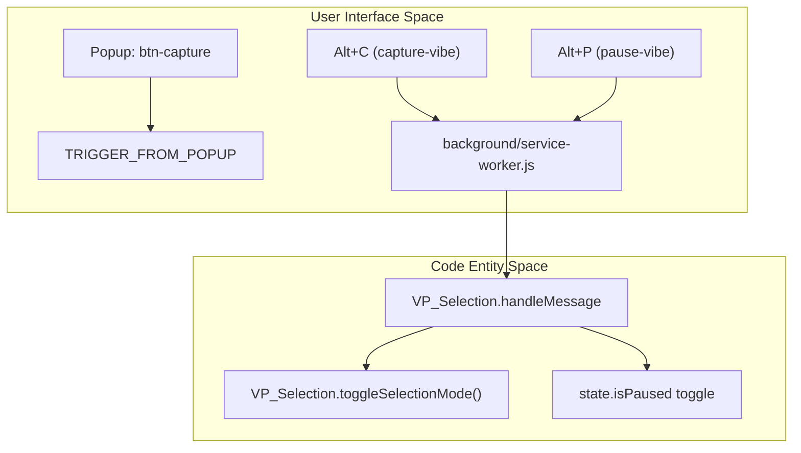
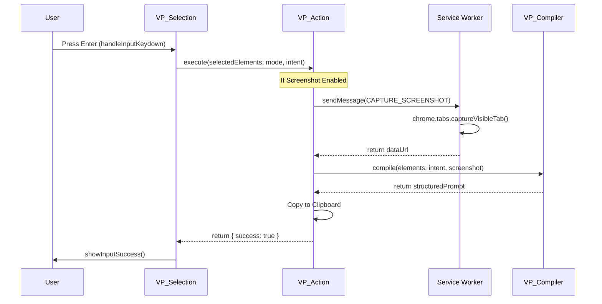

# User Interaction Flows

> **Relevant source files**
> * [background/service-worker.js](https://github.com/mohsinproduct/vibepaste/blob/f3147148/background/service-worker.js)
> * [content/selection.js](https://github.com/mohsinproduct/vibepaste/blob/f3147148/content/selection.js)
> * [popup/popup.html](https://github.com/mohsinproduct/vibepaste/blob/f3147148/popup/popup.html)
> * [popup/popup.js](https://github.com/mohsinproduct/vibepaste/blob/f3147148/popup/popup.js)

This page provides a technical walkthrough of the two primary user workflows in VibePaste: **Fix Mode** and **Copy Mode**. It details the transition from initiation (keyboard or popup) through the selection lifecycle, intent capture, and final execution.

## Entry Points and Initiation

Users can initiate the VibePaste selection engine via two paths: the Browser Action popup or global keyboard shortcuts. Both paths converge on the `background/service-worker.js` which routes the request to the active tab.

### Initiation Logic Flow

The following diagram illustrates how the `background/service-worker.js` acts as a hub for user intent.

**Diagram: Initiation Hub**

**Sources:** [background/service-worker.js L4-L29](https://github.com/mohsinproduct/vibepaste/blob/f3147148/background/service-worker.js#L4-L29)

 [background/service-worker.js L35-L42](https://github.com/mohsinproduct/vibepaste/blob/f3147148/background/service-worker.js#L35-L42)

 [popup/popup.js L92-L95](https://github.com/mohsinproduct/vibepaste/blob/f3147148/popup/popup.js#L92-L95)

 [content/selection.js L81-L101](https://github.com/mohsinproduct/vibepaste/blob/f3147148/content/selection.js#L81-L101)

---

## The Selection Lifecycle

Once `VP_Selection.toggleSelectionMode()` is invoked, the extension enters an active state where the DOM is instrumented for interaction.

### 1. Activation and Command Bar

* **State Update**: `state.isActive` is set to true [content/selection.js L42](https://github.com/mohsinproduct/vibepaste/blob/f3147148/content/selection.js#L42-L42)
* **UI Injection**: `VP_UI.toggleCommandBar(true)` displays the floating input field and mic button [content/selection.js L54](https://github.com/mohsinproduct/vibepaste/blob/f3147148/content/selection.js#L54-L54)
* **Focus**: The input field (`uiControls.input`) is automatically focused to allow immediate typing [content/selection.js L55](https://github.com/mohsinproduct/vibepaste/blob/f3147148/content/selection.js#L55-L55)

### 2. Element Selection and Hover

The engine uses a combination of `mousemove` and `click` listeners to allow multi-element selection.

* **Hover**: `handleMouseMove` calculates element dimensions via `getBoundingClientRect()` and requests `VP_UI.showHoverOverlay()` [content/selection.js L103-L123](https://github.com/mohsinproduct/vibepaste/blob/f3147148/content/selection.js#L103-L123)
* **Selection**: `handleMouseClick` prevents default browser behavior and toggles the element in `state.selectedElements` [content/selection.js L125-L144](https://github.com/mohsinproduct/vibepaste/blob/f3147148/content/selection.js#L125-L144)
* **Visual Feedback**: Every click triggers `redrawAllOverlays()`, which creates `vibepaste-static-overlay` instances with numbered badges [content/selection.js L60-L65](https://github.com/mohsinproduct/vibepaste/blob/f3147148/content/selection.js#L60-L65)

### 3. Voice Intent (Optional)

If `vp_auto_mic` is enabled in `chrome.storage.local`, selecting the first element automatically triggers the `VP_Voice` engine [content/selection.js L145-L151](https://github.com/mohsinproduct/vibepaste/blob/f3147148/content/selection.js#L145-L151)

**Sources:** [content/selection.js L41-L58](https://github.com/mohsinproduct/vibepaste/blob/f3147148/content/selection.js#L41-L58)

 [content/selection.js L103-L157](https://github.com/mohsinproduct/vibepaste/blob/f3147148/content/selection.js#L103-L157)

 [popup/popup.js L12](https://github.com/mohsinproduct/vibepaste/blob/f3147148/popup/popup.js#L12-L12)

---

## Execution Pipeline (The "Enter" Flow)

The workflow concludes when the user presses `Enter` in the command bar. This initiates a complex pipeline that bridges the DOM to the LLM prompt.

**Diagram: Execution Data Flow**

### Mode-Specific Logic

The `state.mode` (Fix vs. Copy) determines how the `VP_Compiler` assembles the prompt:

* **Fix Mode**: Focused on identifying bugs, UI inconsistencies, or logic errors in the selected elements [content/selection.js L5](https://github.com/mohsinproduct/vibepaste/blob/f3147148/content/selection.js#L5-L5)
* **Copy Mode**: Focused on extracting code, styles, or content for reuse [popup/popup.html L30-L34](https://github.com/mohsinproduct/vibepaste/blob/f3147148/popup/popup.html#L30-L34)

### Technical Implementation Details

| Function | Responsibility | Source |
| --- | --- | --- |
| `handleInputKeydown` | Listens for `Enter`, stops voice, and calls Action. | [content/selection.js L159-L193](https://github.com/mohsinproduct/vibepaste/blob/f3147148/content/selection.js#L159-L193) |
| `VP_Action.execute` | Orchestrates extraction, screenshotting, and compilation. | [content/selection.js L179-L183](https://github.com/mohsinproduct/vibepaste/blob/f3147148/content/selection.js#L179-L183) |
| `captureVisibleTab` | Background API used to get visual context. | [background/service-worker.js L45-L58](https://github.com/mohsinproduct/vibepaste/blob/f3147148/background/service-worker.js#L45-L58) |
| `showInputSuccess` | Provides visual "flash" feedback on the command bar. | [content/selection.js L186](https://github.com/mohsinproduct/vibepaste/blob/f3147148/content/selection.js#L186-L186) |

**Sources:** [content/selection.js L159-L193](https://github.com/mohsinproduct/vibepaste/blob/f3147148/content/selection.js#L159-L193)

 [background/service-worker.js L45-L58](https://github.com/mohsinproduct/vibepaste/blob/f3147148/background/service-worker.js#L45-L58)

 [popup/popup.js L10-L13](https://github.com/mohsinproduct/vibepaste/blob/f3147148/popup/popup.js#L10-L13)

---

## State Management and Persistence

The user's preferences are synchronized across the popup and content scripts using `chrome.storage.local`.

* **Live Sync**: `VP_Selection` listens for `chrome.storage.onChanged`. If a user changes the mode (Fix/Copy) in the popup while selection is active, the content script updates its internal `state.mode` immediately [content/selection.js L23-L28](https://github.com/mohsinproduct/vibepaste/blob/f3147148/content/selection.js#L23-L28)
* **Settings Manager**: The `popup/popup.js` `SettingsManager` object handles the initialization and saving of checkboxes (Screenshot, Auto-Mic, Smart Guidance) [popup/popup.js L8-L33](https://github.com/mohsinproduct/vibepaste/blob/f3147148/popup/popup.js#L8-L33)
* **Handshake**: When the popup opens, it sends an `IS_ACTIVE` message to the content script to determine if the "Start Capturing" button should show a "Finish Capturing" state [popup/popup.js L78-L89](https://github.com/mohsinproduct/vibepaste/blob/f3147148/popup/popup.js#L78-L89)

**Sources:** [content/selection.js L18-L28](https://github.com/mohsinproduct/vibepaste/blob/f3147148/content/selection.js#L18-L28)

 [popup/popup.js L8-L33](https://github.com/mohsinproduct/vibepaste/blob/f3147148/popup/popup.js#L8-L33)

 [popup/popup.js L78-L89](https://github.com/mohsinproduct/vibepaste/blob/f3147148/popup/popup.js#L78-L89)