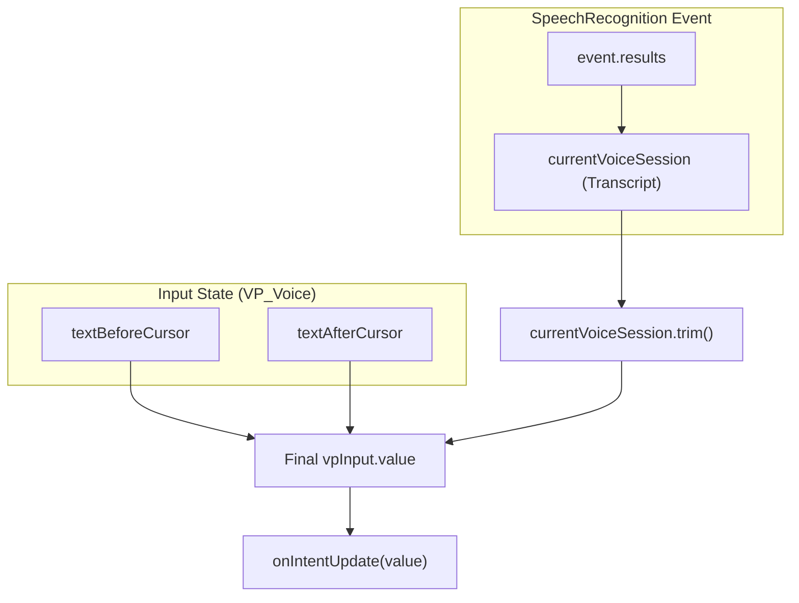
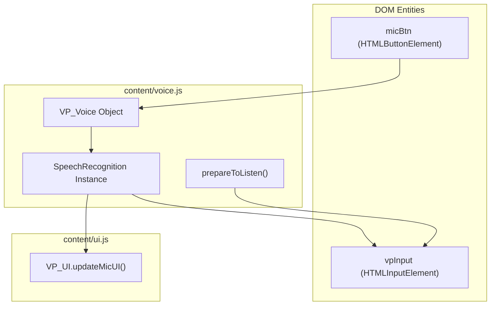

# Voice Input (VP_Voice)

> **Relevant source files**
> * [content/voice.js](https://github.com/mohsinproduct/vibepaste/blob/f3147148/content/voice.js)

The `VP_Voice` module provides a hands-free interface for defining AI intent within the VibePaste ecosystem. It leverages the browser's native **Web Speech API** to convert spoken language into text, allowing users to describe transformations (Fix Mode) or requests (Copy Mode) without manual typing.

## Overview and Initialization

The `VP_Voice` object manages the lifecycle of speech recognition, handling browser compatibility checks, session persistence, and UI synchronization.

The module is initialized via the `init` function [content/voice.js L10-L88](https://github.com/mohsinproduct/vibepaste/blob/f3147148/content/voice.js#L10-L88)

 which accepts the microphone button element, the intent input field, and a callback for state updates.

### Compatibility Check

Upon initialization, the script checks for the presence of `window.SpeechRecognition` or `window.webkitSpeechRecognition` [content/voice.js L11](https://github.com/mohsinproduct/vibepaste/blob/f3147148/content/voice.js#L11-L11)

 If the API is unsupported:

1. The microphone button is hidden from the UI [content/voice.js L14](https://github.com/mohsinproduct/vibepaste/blob/f3147148/content/voice.js#L14-L14)
2. A warning is logged to the console [content/voice.js L15](https://github.com/mohsinproduct/vibepaste/blob/f3147148/content/voice.js#L15-L15)

### Configuration

The `SpeechRecognition` instance is configured with specific parameters to optimize for real-time intent entry:

* **`continuous = true`**: Prevents the session from ending automatically after a single phrase [content/voice.js L20](https://github.com/mohsinproduct/vibepaste/blob/f3147148/content/voice.js#L20-L20)
* **`interimResults = true`**: Enables real-time feedback by providing partial transcriptions as the user speaks [content/voice.js L21](https://github.com/mohsinproduct/vibepaste/blob/f3147148/content/voice.js#L21-L21)
* **`lang = 'en-US'`**: Sets the default recognition language [content/voice.js L22](https://github.com/mohsinproduct/vibepaste/blob/f3147148/content/voice.js#L22-L22)

## Text Preservation Logic

A critical feature of `VP_Voice` is its ability to insert transcribed text at the current cursor position while preserving existing text in the input field. This allows users to mix typing and voice input seamlessly.

### Cursor Management

When a voice session starts, the `prepareToListen` helper [content/voice.js L24-L37](https://github.com/mohsinproduct/vibepaste/blob/f3147148/content/voice.js#L24-L37)

 captures the state of the input field:

1. **`textBeforeCursor`**: Captures text from the start of the field to the `selectionStart` [content/voice.js L28](https://github.com/mohsinproduct/vibepaste/blob/f3147148/content/voice.js#L28-L28)
2. **`textAfterCursor`**: Captures text from the `selectionEnd` to the end of the field [content/voice.js L29](https://github.com/mohsinproduct/vibepaste/blob/f3147148/content/voice.js#L29-L29)
3. **Smart Spacing**: The logic automatically appends a trailing space to `textBeforeCursor` [content/voice.js L31-L33](https://github.com/mohsinproduct/vibepaste/blob/f3147148/content/voice.js#L31-L33)  and prepends a leading space to `textAfterCursor` [content/voice.js L34-L36](https://github.com/mohsinproduct/vibepaste/blob/f3147148/content/voice.js#L34-L36)  if they are not already present, ensuring the voice-transcribed text is properly delimited.

### Text Assembly Flow

The following diagram illustrates how the final intent string is constructed during the `onresult` event.

**Voice Result Assembly**

Sources: [content/voice.js L54-L63](https://github.com/mohsinproduct/vibepaste/blob/f3147148/content/voice.js#L54-L63)

## Lifecycle and Auto-Restart

The Web Speech API often times out or is interrupted by the browser. `VP_Voice` implements a "sticky" listening state to ensure a smooth user experience.

### State Tracking

The module maintains two internal flags:

* **`isListening`**: Tracks the actual active state of the hardware microphone [content/voice.js L5](https://github.com/mohsinproduct/vibepaste/blob/f3147148/content/voice.js#L5-L5)
* **`shouldListen`**: Tracks the user's *intent* to be listening [content/voice.js L6](https://github.com/mohsinproduct/vibepaste/blob/f3147148/content/voice.js#L6-L6)

### Auto-Restart Mechanism

When the browser ends a session (e.g., due to silence or network timeout), the `onend` handler [content/voice.js L65-L80](https://github.com/mohsinproduct/vibepaste/blob/f3147148/content/voice.js#L65-L80)

 checks the `shouldListen` flag. If the user has not explicitly clicked the stop button, the module calls `prepareToListen()` to update cursor context and restarts the recognition engine [content/voice.js L68-L74](https://github.com/mohsinproduct/vibepaste/blob/f3147148/content/voice.js#L68-L74)

### Intent Synchronization

Whenever the transcript updates, the module executes the `onIntentUpdate` callback [content/voice.js L62](https://github.com/mohsinproduct/vibepaste/blob/f3147148/content/voice.js#L62-L62)

 This ensures that the `VP_Selection` state and other components are aware of the latest user intent as it is being spoken.

## Interface and Events

The interaction between the Voice module and the broader system is handled through a set of event handlers and UI updates.

| Event / Method | Action | Source |
| --- | --- | --- |
| `micBtn.onclick` | Toggles `shouldListen` and starts/stops recognition. | [content/voice.js L38-L46](https://github.com/mohsinproduct/vibepaste/blob/f3147148/content/voice.js#L38-L46) |
| `onstart` | Sets `isListening` to true and updates UI via `VP_UI.updateMicUI(true)`. | [content/voice.js L48-L52](https://github.com/mohsinproduct/vibepaste/blob/f3147148/content/voice.js#L48-L52) |
| `onresult` | Aggregates all transcript results and updates the input value. | [content/voice.js L54-L63](https://github.com/mohsinproduct/vibepaste/blob/f3147148/content/voice.js#L54-L63) |
| `onend` | Resets `isListening` and either restarts or resets UI based on `shouldListen`. | [content/voice.js L65-L80](https://github.com/mohsinproduct/vibepaste/blob/f3147148/content/voice.js#L65-L80) |
| `onerror` | Logs errors (except 'no-speech') and invokes `stop()`. | [content/voice.js L82-L87](https://github.com/mohsinproduct/vibepaste/blob/f3147148/content/voice.js#L82-L87) |

**Voice Logic Entity Mapping**

Sources: [content/voice.js L10-L11](https://github.com/mohsinproduct/vibepaste/blob/f3147148/content/voice.js#L10-L11)

 [content/voice.js L38-L46](https://github.com/mohsinproduct/vibepaste/blob/f3147148/content/voice.js#L38-L46)

 [content/voice.js L50](https://github.com/mohsinproduct/vibepaste/blob/f3147148/content/voice.js#L50-L50)

 [content/voice.js L60](https://github.com/mohsinproduct/vibepaste/blob/f3147148/content/voice.js#L60-L60)